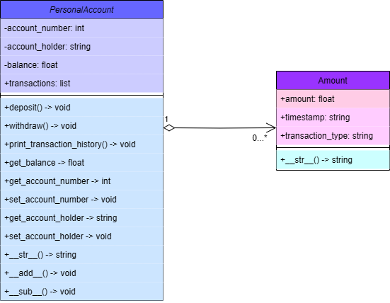

# Simple bank account 
written on Python
 

## Navigation
- [Classes source code](bank.py) 
- [Testing file](main.py) 
- [UML diagram](UML_diagram.png) 
 

## bank.py
This file contains `Amount` and `PersonalAccount` classes. These are the main things in this repository.

## **Amount class**
- **Attributes**
    - `amount: float` - the amount of money
    - `timestamp: str` - time when the transaction was proccessed
    - `transaction_type: str` - type of a transaction(`DEPOSIT` or `WITHDRAWAL`)
 

The class only has 1 method, the magic one: `__str__()`

## **PersonalAccount class**
- **Attributes**
    - `account_number: int` - account number
    - `account_holder: str` - account holder's name
    - `balance: float` - balance of an account (default set to 0.0)
    - `transactions: list` - list of transactions (list of `Amount` instances)

 

- **Methods**
    - `deposit(amount) -> None` - method to deposit money to account, adds this transaction to `transactions` attribute
    - `withdraw(amount) -> None` - method to withdraw money from account, adds this transaction to `transactions` attribute
    - `print_transaction_history() -> None` - prints all transactions in `transactions` variable
    - `get_balance() -> float` - returns current balance
    - `get_account_number() -> int` - returns account number
    - `set_account_number(new_account_number) -> None` - allows to change account number
    - `get_account_holder() -> str` - returns account holder's name
    - `set_account_holder(new_account_holder) -> None` - allows to change account holder's name

And some magic methods

## main.py
This file is created to test functionality of `Amount` and `PersonalAccount` classes. Everything about testing is there.

> [!TIP]
> When you choose option that displays something, and you see blinking cursor, at this time just press enter.